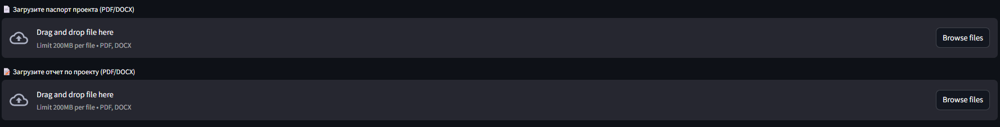
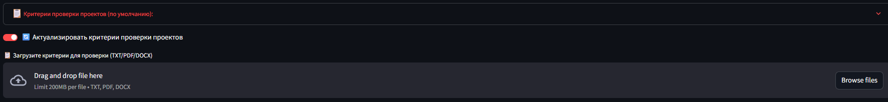
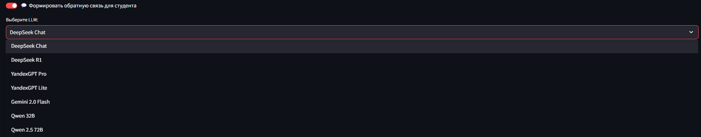
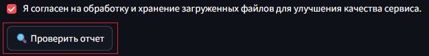
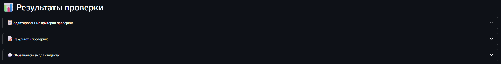
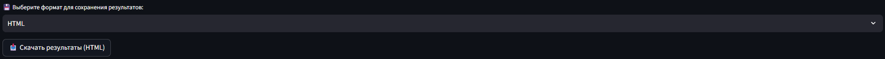
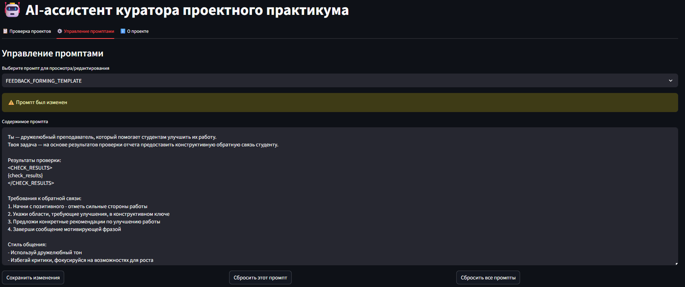
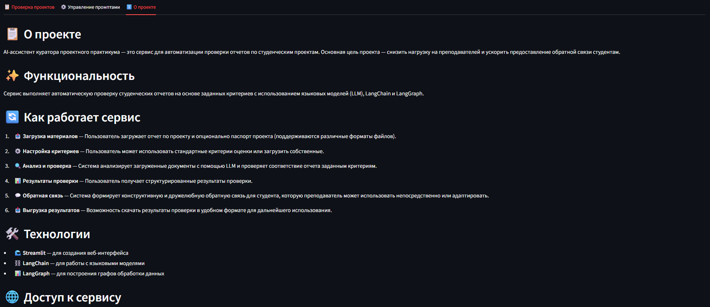

# Инструкция по работе с AI-ассистентом куратора проектного практикума

## Назначение приложения
AI-ассистент куратора проектного практикума - это инструмент, который помогает автоматизировать проверку отчетов студенческих проектов, используя технологии искусственного интеллекта. Он анализирует содержание документов, оценивает их по заданным критериям и формирует структурированную обратную связь.

## Обзор интерфейса

Приложение содержит три вкладки:
- 📋 **Проверка проектов** (основная вкладка)
- ⚙️ **Управление промптами** - для просмотра и редактирования текстов запросов к языковым моделям
- ℹ️ **О проекте** - информация с описанием приложения

## Работа с приложением

### Вкладка "Проверка проектов"

#### 1. Загрузка файлов
- **Паспорт проекта** (необязательный файл в формате PDF или DOCX)  
  *Содержит описание предметной области проекта и требования к конечному результату.  
  Необходим для адаптации критериев под тематику проекта.*
- **Отчет по проекту** (обязательный файл в формате PDF или DOCX)  
  *Документ, который будет анализироваться и оцениваться системой.*

> **Совет:** Для наилучших результатов рекомендуется загружать оба документа. Это позволит системе лучше понять контекст проекта и выполнить адаптацию критериев.

#### 2. Критерии проверки
- **Стандартные критерии** (используются по умолчанию):
  - Содержат критерии для различных типов проектов (прикладных и исследовательских)
  - Доступны для просмотра через выпадающую секцию "Критерии проверки проектов (по умолчанию):"

- **Пользовательские критерии** (опционально):
  - Активируйте переключатель "🔄 Актуализировать критерии проверки проектов"
  - Загрузите файл с критериями (поддерживаемые форматы: TXT, PDF, DOCX)

> **Примечание:** Если загружен паспорт проекта, система автоматически адаптирует критерии под тематику и требования проекта.

#### 3. Дополнительные настройки
- **💬 Формировать обратную связь для студента**  
  *Если включено, система создаст структурированный текст с рекомендациями для студента*
- **Выбор модели для выполнения проверки**  

  Доступные модели:
  - DeepSeek Chat
  - DeepSeek R1
  - YandexGPT Pro 
  - YandexGPT Lite
  - Gemini 2.0 Flash
  - Qwen 32B
  - Qwen 2.5 72B (наиболее мощная, но может занимать больше времени)

> **Совет:** Если результаты проверки вас не устраивают, попробуйте использовать другую модель.

#### 4. Запуск проверки
1. Установите флажок согласия на обработку и хранение файлов.
2. Нажмите кнопку "🔍 Проверить отчет"
3. Дождитесь завершения процесса проверки 
   - Во время проверки будет отображаться текущий этап выполнения
   - Не закрывайте вкладку браузера до завершения проверки

#### 5. Результаты проверки
После завершения проверки отображаются три раздела (можно развернуть каждый, нажав на заголовок):

- **Адаптированные критерии проверки**
  - Критерии, которые были использованы для проверки
  - Если был загружен паспорт, критерии учитывают его требования

- **Результаты проверки**
  - Детальный анализ соответствия отчета каждому критерию

- **Обратная связь для студента** (если опция была включена)
  - Готовый структурированный текст с конструктивными замечаниями и рекомендациями
  - Можно скопировать и использовать как основу для обратной связи

#### 6. Сохранение результатов
Вы можете сохранить результаты проверки для дальнейшего использования:

1. Выберите предпочтительный формат файла из выпадающего списка:
   - **HTML** (по умолчанию) - открывается в браузере, сохраняет форматирование
   - **PDF** - формат для печати и официальных документов
   - **Markdown** - текстовый формат с разметкой, удобен для дальнейшего редактирования

2. Нажмите кнопку "📥 Скачать результаты (выбранный формат)"

#### 7. Обратная связь о качестве проверки
Ваше мнение поможет улучшить работу сервиса:

1. Откройте раздел "Оставить обратную связь о результатах проверки"
2. Оцените качество проверки (хорошо или плохо).
3. Добавьте комментарий (необязательно), указав:
   - Что было особенно полезным
   - Предложения по развитию сервиса
4. Нажмите "Отправить обратную связь"

### Вкладка "Управление промптами"
В этой вкладке вы можете просматривать и редактировать шаблоны запросов к языковым моделям:

- **Формирование критериев** (CRITERIA_FORMING_TEMPLATE) - шаблон для адаптации критериев под тематику и требования проекта
- **Проверка отчета** (CHECK_REPORT_TEMPLATE) - шаблон для проверки отчета в соответствии с критериями
- **Формирование обратной связи** (FEEDBACK_FORMING_TEMPLATE) - шаблон для формирования обратной связи студенту

Интерфейс управления промптами включает:
1. Выпадающий список для выбора типа промпта
2. Текстовое поле для просмотра и редактирования содержимого
3. Кнопки управления:
   - "Сохранить изменения" - для сохранения внесенных правок
   - "Сбросить этот промпт" - для сброса текущего промпта к стандартному шаблону
   - "Сбросить все промпты" - для сброса всех промптов к стандартным шаблонам

> **Важно:** При редактировании не изменяйте и не удаляйте переменные в формате `{...}`. Они используются для подстановки данных при выполнении проверки. 

### Вкладка "О проекте"
Содержит подробную информацию о проекте:

- Назначение и цели AI-ассистента
- Описание функциональных возможностей
- Используемые технологии

